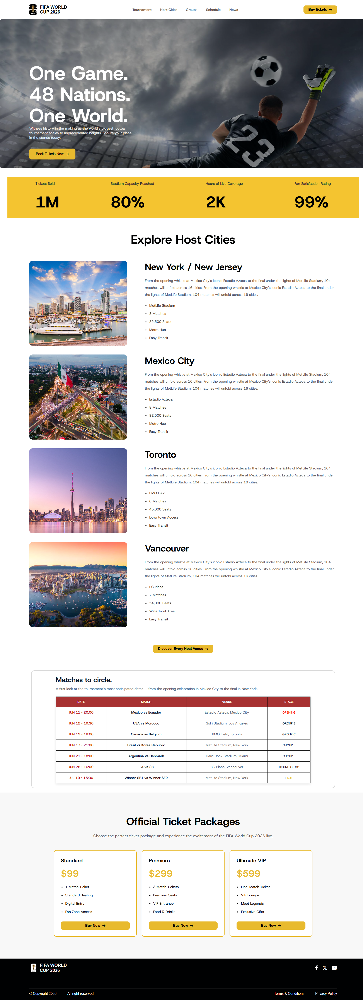
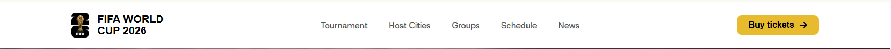
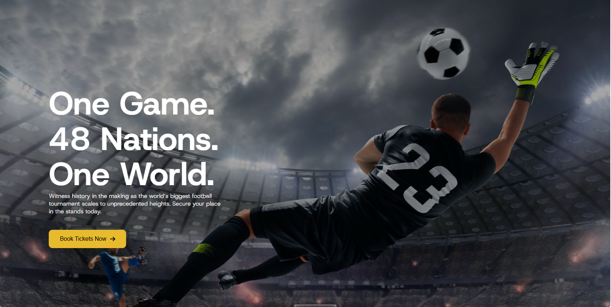
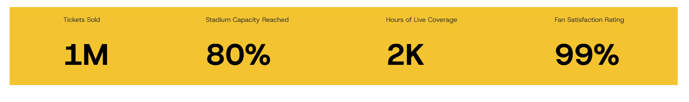
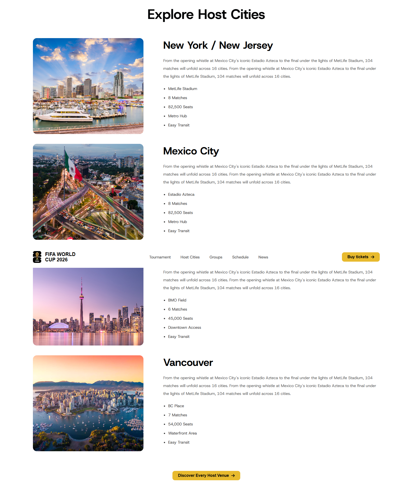
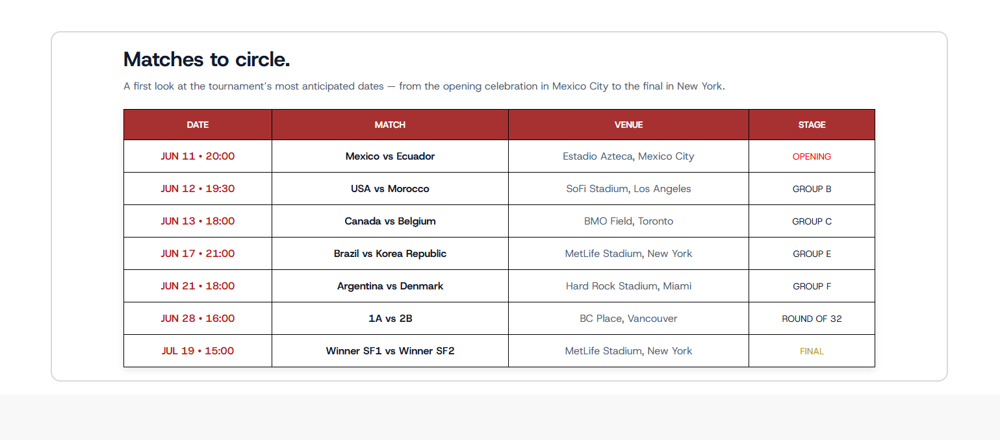
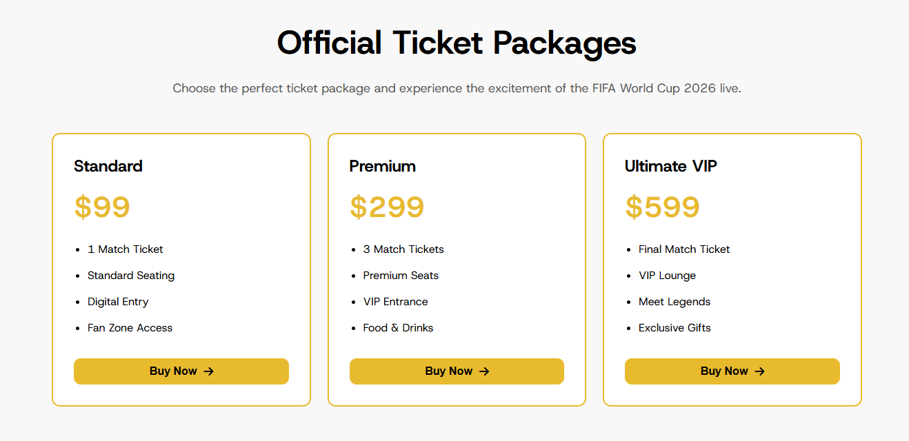
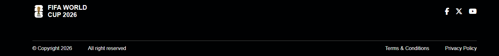

# ⚽ FIFA World Cup 2026 Landing Page

A modern and responsive **FIFA World Cup 2026 Landing Page** built with **HTML5** and **CSS3**. This project features a clean user interface, semantic HTML structure, reusable CSS components, and an engaging football-themed design.

---

## 🌐 Live Demo

> https://aminulislam424842.github.io/practice-02/

## 📂 GitHub Repository

> https://github.com/aminulislam424842/practice-02

---

# 📸 Full Website Preview



---

# ✨ Features

- Responsive Navigation Bar
- Hero Section with CTA
- Tournament Statistics
- Host Cities Showcase
- Match Schedule Table
- Official Ticket Packages
- Professional Footer
- Semantic HTML5
- Reusable CSS Components
- Modern UI Design

---

# 🛠 Technologies Used

- HTML5
- CSS3
- Flexbox
- Font Awesome
- Google Fonts
- Responsive Layout Principles

---

# 📑 Website Sections

---

## 1️⃣ Navigation Bar

### Features

- FIFA Logo
- Navigation Links
- Buy Tickets Button
- Fixed Navigation

### Preview



---

## 2️⃣ Hero Section

### Features

- Full Width Banner
- Gradient Overlay
- CTA Button
- Modern Typography

### Preview



---

## 3️⃣ Tournament Statistics

### Features

- Tickets Sold
- Stadium Capacity
- Live Coverage
- Fan Satisfaction

### Preview



---

## 4️⃣ Host Cities

### Features

- Multiple Host Cities
- Stadium Information
- City Description
- Feature List

### Preview



---

## 5️⃣ Match Schedule

### Features

- Tournament Schedule
- Match Details
- Venue Information
- Tournament Stage

### Preview



---

## 6️⃣ Official Ticket Packages

### Features

- Standard Package
- Premium Package
- Ultimate VIP Package
- Buy Ticket CTA

### Preview



---

## 7️⃣ Footer

### Features

- FIFA Branding
- Social Media Icons
- Copyright
- Terms & Privacy Links

### Preview



---

# 📁 Folder Structure

```text
practice-02/
│
├── assets/
│   ├── banner.png
│   ├── logo.webp
│   ├── logo-footer.png
│   ├── Mexico.jpg
│   ├── NewYork.jpg
│   ├── Toronto.jpg
│   └── Vancouver.webp
│
├── preview/
│   ├── full.png
│   ├── nav.png
│   ├── hero-section.png
│   ├── Statistics.png
│   ├── host.png
│   ├── table.png
│   ├── price.png
│   └── footer.png
│
├── index.html
├── style.css
├── prompt.md
└── README.md
```

---

# 🎨 Color Palette

| Color | Hex Code | Usage |
|--------|----------|----------------|
| Gold | `#E8BA2E` | Buttons, Pricing |
| World Cup Yellow | `#F4C430` | Statistics Section |
| Dark | `#000102` | Footer, Text |
| White | `#FFFFFF` | Background |
| Heading | `#111C2D` | Headings |
| Gray | `#575757` | Paragraphs |
| Secondary Gray | `#505F76` | Table Text |
| Border Gray | `#D9D9D9` | Borders |
| Card Background | `#F8F8F8` | Ticket Section |
| Table Header | `#A73131` | Table Header |
| Match Red | `#BA1A1A` | Match Date |

### Transparency Colors

- `rgba(0,0,0,0.35)` — Hero Overlay
- `rgba(255,255,255,0.90)` — Hero Description
- `rgba(5,48,238,0.76)` — Social Icon Hover

---

# 📱 Responsive Design

- Desktop Optimized
- Modern Layout
- Flexbox Based Components
- Reusable UI Structure

---

# 🚀 Getting Started

Clone the repository

```bash
git clone https://github.com/aminulislam424842/practice-02.git
```

Go to the project directory

```bash
cd practice-02
```

Open

```text
index.html
```

using your favorite browser.

---

# 📚 What I Practiced

- Semantic HTML5
- CSS Flexbox
- Fixed Navigation
- Background Overlay
- Typography
- Card Layout
- Table Design
- Component Reusability
- Folder Organization
- Git & GitHub Workflow

---

# 🎯 Future Improvements

- Responsive Mobile Layout
- CSS Animations
- JavaScript Interactions
- Countdown Timer
- Dark Mode
- Ticket Booking Form

---

# 👨‍💻 Author

**Md. Aminul Islam**

Future Full Stack Developer

---

# ⭐ Support

If you like this project, consider giving it a **⭐ Star** on GitHub.